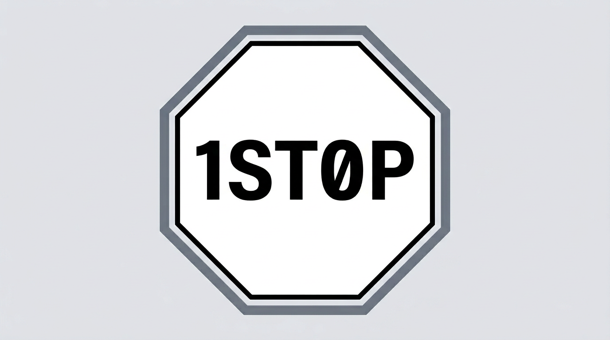

  

  

# 1ST0P

**Vision**

1ST0P is being built as a **single home for serious Solana builders and the people who hire them**—a place where **discovery, credibility, and execution** meet on-chain.

**North-star goals**

- **A true one-stop hub for developer needs** — community, tooling context, planning, exposure, and collaboration, organized around real projects rather than anonymous tickers.
- **A launchpad grounded in identity and intent** — teams are expected to be **doxxed**, complete a **structured interview**, and **present their product and roadmap** so participants understand who is shipping and where the work is headed.
- **A marketplace for development talent** — service providers can **register**, build **reputation through rankings and verified reviews**, and be **hired through the platform**, with **funds held in treasury/escrow** until milestones or deliverables are satisfied.
- **A safer venue for capital** — traders and supporters interact with **accountable teams and verifiable builders**, reducing reliance on anonymous launches and moving toward **investment in people and execution**, not just charts.

**What this repository contains today**

This repo currently ships the **first vertical**: a **Solana program** (`programs/1ST0P`, crate **`onestop`**) implementing a **bonding-curve launchpad** (devnet-oriented), plus a **Next.js** frontend for wallet connection, initialization, launches, and trading against the curve. The broader platform vision above is **roadmap**; this codebase is the **launchpad foundation**.

Rust identifiers cannot start with a digit, so the on-chain crate and module are named **`onestop`** while the product name is **1ST0P**.
